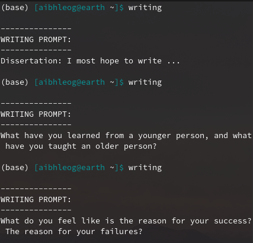

# phd-writing-prompts
The `get-prompt.py` script in this repo can be used to randomly pull a writing prompt from the `list-of-prompts.txt` file (which you can add more things to as well).  I also recommend you add an alias in your `.bashrc` or `.bash_profile` file so that you can run this script from your terminal.

This is what mine looks like:
```bash
alias writing='/path/to/file/phd-writing-prompts/get-prompt.py'
```

Then the output will look like this:  


